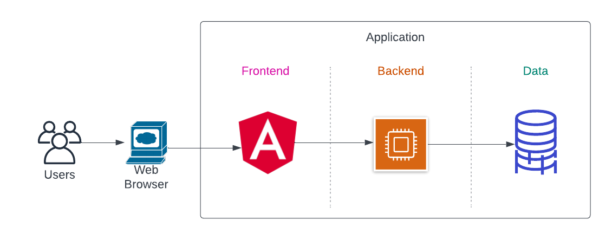
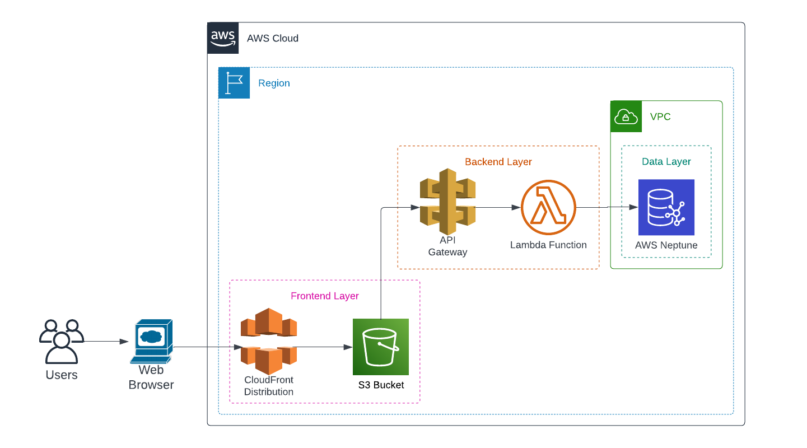
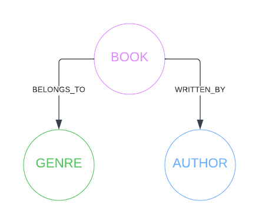

# AALN (AWS Angular Lambda Neptune)

## Scope

Create an application which will display the content of the a graph database. The application and all its components should be based on AWS services.

## Architecture

### Application



The application is a typical 3 tier web application consisting of a frontend, backend and a database.

The [frontend](./frontend/) component is created using Angular.

The [backend](./backend/) component consists of a Lambda function. The role of the Lambda function is to interogate the database and return the results to the frontend.

The database component consists of a AWS Neptune instance. The demo content for the database is loaded by the backend Lambda function.

### Infrastructure



The frontend component is deployed to an S3 bucket. The bucket is configured to deny all public access and to expose the content as a website. The users interact with the frontend component via a CloudFront distribution which fetches and caches the frontend content.

The backend component is deployed using a Lambda function. To access the Lambda function, an API Gateway route is deployed which forwards the requests to the function. This will also ensure a single URL is provided to the clients.

The backend URL is provided to the frontend component at build time using an environment variable.

The whole infrastructure is modeled using Terraform. The plan to execute the deployment can be found in the [infrastructure](./infrastructure/) location.

### Data

The data model for this application consists of the following:

- vertices
  - book
  - author
  - genre
- edges
  - book > BELONGS_TO > genre
  - book > WRITTEN_BY > author



## Requirements

To run the frontend component locally you need:

- `npm`
- [Angular CLI](https://angular.io/cli)

To run the backend and data components locally you need:

- `Docker`
- `Docker Compose`
- `Python 3.8`

To deploy to AWS:

- `AWS CLI`
- `Terraform`
- `zip` utility
- all the frontend requirements

## Running

### Local

To run the frontend locally execute the following:

```shell
cd ./frontend
ng serve -o
```

A browser window should open and you should be able to see the frontend working. The data you see comes from a [test data JSON file](./frontend/test_data/test.json).

### AWS

To deploy all the components to AWS configure the Terraform variables under the [infrastructure](./infrastructure/) folder and execute the Terraform plan:

```shell
cd ./infrastructure
terraform init
terraform apply --auto-approve
```

At the end of the execution you will be presented with both frontend and backend URLs.
